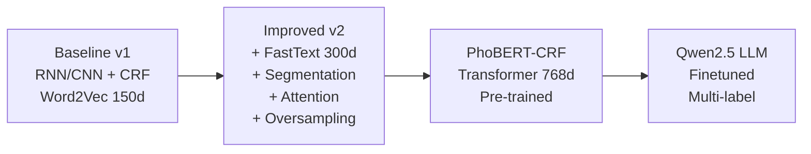
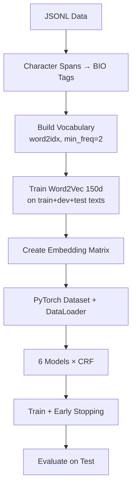
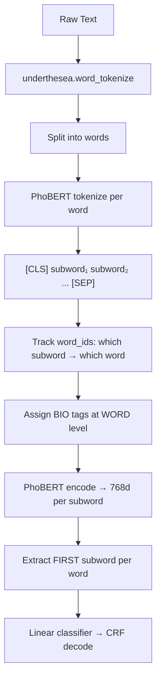
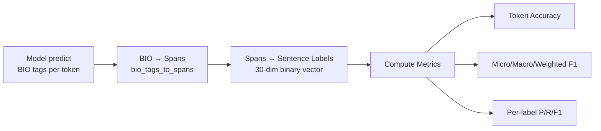
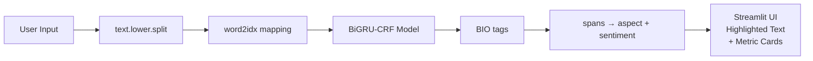

# 📋 Project Plan Chi Tiết — Vietnamese ABSA Pipeline

## Hướng dẫn Tái sử dụng cho Dataset Khác

> [!IMPORTANT]
> Tài liệu này mô tả **chi tiết từng bước** đã thực hiện trong project Vietnamese Aspect-Based Sentiment Analysis (ABSA), bao gồm code, kiến trúc, và các quyết định thiết kế. Mục tiêu: **bạn có thể copy pipeline này và áp dụng cho bất kỳ dataset ABSA nào khác**.

---

## 📑 Mục Lục

1. [Tổng Quan Project](#1-tổng-quan-project)
2. [Định Dạng Dữ Liệu Đầu Vào](#2-định-dạng-dữ-liệu-đầu-vào)
3. [Phase 1: EDA — Khám Phá Dữ Liệu](#3-phase-1-eda--khám-phá-dữ-liệu)
4. [Phase 2: Baseline Models (RNN/CNN + CRF)](#4-phase-2-baseline-models-rnncnn--crf)
5. [Phase 3: Improved Baselines v2](#5-phase-3-improved-baselines-v2)
6. [Phase 4: PhoBERT-CRF (Transformer)](#6-phase-4-phobert-crf-transformer)
7. [Phase 5: Evaluation & Analysis](#7-phase-5-evaluation--analysis)
8. [Phase 6: Demo Application](#8-phase-6-demo-application)
9. [Utils & Shared Code](#9-utils--shared-code)
10. [Hướng Dẫn Áp Dụng Dataset Khác](#10-hướng-dẫn-áp-dụng-dataset-khác)
11. [Cấu Trúc Thư Mục](#11-cấu-trúc-thư-mục)

---

## 1. Tổng Quan Project

### 1.1 Bài toán

| Thuộc tính | Giá trị |
|:---|:---|
| **Task** | Aspect-Based Sentiment Analysis (ABSA) |
| **Sub-task** | Joint Extraction — Đồng thời phát hiện Aspect + Sentiment từ text |
| **Ngôn ngữ** | Tiếng Việt |
| **Approach** | BIO Sequence Labeling + CRF Decoding |
| **Domain** | Product Reviews (điện thoại) |

### 1.2 Phương pháp chính: BIO Sequence Labeling

Thay vì phân loại câu (sentence classification), project này dùng **BIO tagging** trên từng token:

```
Text:     "Pin    trâu,  camera  chụp   đẹp"
BIO tags: B-BAT  I-BAT  B-CAM   I-CAM  I-CAM
          ↳ BATTERY#POSITIVE    ↳ CAMERA#POSITIVE
```

- **B-{ASPECT#SENTIMENT}**: Begin — token đầu tiên của span
- **I-{ASPECT#SENTIMENT}**: Inside — token tiếp theo trong span
- **O**: Outside — không thuộc entity nào

### 1.3 Label System

- **10 Aspects:** CAMERA, FEATURES, PERFORMANCE, DESIGN, PRICE, GENERAL, SCREEN, BATTERY, STORAGE, SER&ACC
- **3 Sentiments:** POSITIVE, NEUTRAL, NEGATIVE
- **30 Combined labels:** ASPECT#SENTIMENT (vd. `CAMERA#POSITIVE`)
- **61 BIO tags:** O + B-{label} + I-{label} (1 + 30×2)

### 1.4 Dataset: UIT-ViSD4SA

| Split | Số lượng |
|:---|:---:|
| Train | 7,785 |
| Dev | 1,112 |
| Test | 2,225 |
| **Total** | **11,122** |

### 1.5 Tiến trình Models (từ đơn giản → phức tạp)



---

## 2. Định Dạng Dữ Liệu Đầu Vào

### 2.1 Format: JSONL (JSON Lines)

Mỗi dòng trong file [.jsonl](file:///c:/Users/Dell/machine%20learning/data%20NLP%20vietnamese/data/data/Vietnamese-Aspect-based-sentiment-analyst-project/dev.jsonl) là một JSON object:

```json
{
  "text": "Pin sài tầm 50h cho pin 100/100. Camera ổn ... tất cả đều OK",
  "labels": [
    [0, 31, "BATTERY#POSITIVE"],
    [33, 42, "CAMERA#POSITIVE"],
    [47, 60, "GENERAL#POSITIVE"]
  ]
}
```

### 2.2 Giải thích format

| Field | Type | Mô tả |
|:---|:---|:---|
| [text](file:///c:/Users/Dell/machine%20learning/data%20NLP%20vietnamese/data/data/Vietnamese-Aspect-based-sentiment-analyst-project/utils/text_utils.py#34-94) | `string` | Nội dung review gốc |
| [labels](file:///c:/Users/Dell/machine%20learning/data%20NLP%20vietnamese/data/data/Vietnamese-Aspect-based-sentiment-analyst-project/phobert_crf.py#387-398) | `list[list]` | Danh sách các annotation |
| `labels[i][0]` | `int` | **Start character position** (0-indexed) |
| `labels[i][1]` | `int` | **End character position** (exclusive) |
| `labels[i][2]` | `string` | **Label** dạng `ASPECT#SENTIMENT` |

### 2.3 Files cần có

```
your_project/
├── train.jsonl     # Training set
├── dev.jsonl       # Validation/Development set
└── test.jsonl      # Test set
```

> [!TIP]
> **Khi áp dụng dataset khác**, chỉ cần chuyển data về đúng format JSONL trên. Tất cả pipeline phía sau đều đọc từ format này.

---

## 3. Phase 1: EDA — Khám Phá Dữ Liệu

**File:** [EDA.ipynb](file:///c:/Users/Dell/machine%20learning/data%20NLP%20vietnamese/data/data/Vietnamese-Aspect-based-sentiment-analyst-project/EDA.ipynb)

### 3.1 Các bước EDA đã thực hiện

| # | Phân tích | Code snippet |
|:---|:---|:---|
| 1 | **Load data** — Đọc JSONL | `json.loads(line)` cho mỗi dòng |
| 2 | **Thống kê cơ bản** — Số samples / split | [len(train), len(dev), len(test)](file:///c:/Users/Dell/machine%20learning/data%20NLP%20vietnamese/data/data/Vietnamese-Aspect-based-sentiment-analyst-project/phobert_crf.py#256-258) |
| 3 | **Phân bố Aspect** — Bar chart | `Counter([label for item for label in item['labels']])` |
| 4 | **Phân bố Sentiment** — Bar/Pie chart | Tách `ASPECT#SENTIMENT` → count sentiment |
| 5 | **Phân bố Sentiment theo Aspect** — Stacked bar | Cross-tabulation aspect × sentiment |
| 6 | **Phân bố độ dài review** — Histogram | [len(text.split())](file:///c:/Users/Dell/machine%20learning/data%20NLP%20vietnamese/data/data/Vietnamese-Aspect-based-sentiment-analyst-project/phobert_crf.py#256-258) distribution |
| 7 | **Số labels per sample** — Distribution | [len(item['labels'])](file:///c:/Users/Dell/machine%20learning/data%20NLP%20vietnamese/data/data/Vietnamese-Aspect-based-sentiment-analyst-project/phobert_crf.py#256-258) histogram |
| 8 | **Word Cloud** — Toàn bộ / theo Aspect / theo Sentiment | `wordcloud.WordCloud()` |
| 9 | **Data Imbalance** — Xác định nhãn hiếm | So sánh count các label |

### 3.2 Phát hiện chính

- **Data Imbalance nghiêm trọng:** POSITIVE chiếm đa số, NEUTRAL rất ít
- **Nhãn cực hiếm:** STORAGE#NEUTRAL (< 15 samples), SER&ACC#NEUTRAL (< 15 samples)
- **Multi-label:** Mỗi câu có thể có nhiều ASPECT#SENTIMENT cùng lúc

> [!WARNING]
> Khi apply dataset mới, **phải chạy EDA trước** để hiểu phân bố dữ liệu. Data imbalance là vấn đề phổ biến và ảnh hưởng trực tiếp đến chiến lược training.

---

## 4. Phase 2: Baseline Models (RNN/CNN + CRF)

**File chính:** [baseline_all_models_crf.ipynb](file:///c:/Users/Dell/machine%20learning/data%20NLP%20vietnamese/data/data/Vietnamese-Aspect-based-sentiment-analyst-project/baseline_all_models_crf.ipynb)
**File evaluate:** [evaluate_baseline_models.ipynb](file:///c:/Users/Dell/machine%20learning/data%20NLP%20vietnamese/data/data/Vietnamese-Aspect-based-sentiment-analyst-project/evaluate_baseline_models.ipynb)
**Models saved:** [dl_all_models_bio_crf/](file:///c:/Users/Dell/machine%20learning/data%20NLP%20vietnamese/data/data/Vietnamese-Aspect-based-sentiment-analyst-project/dl_all_models_bio_crf)

### 4.1 Pipeline tổng quan



### 4.2 Step-by-step Chi Tiết

#### Step 1: Constants & Label System

```python
ASPECTS = ["CAMERA","FEATURES","PERFORMANCE","DESIGN","PRICE",
           "GENERAL","SCREEN","BATTERY","STORAGE","SER&ACC"]
SENTIMENTS = ["POSITIVE","NEUTRAL","NEGATIVE"]
LABEL_NAMES = [f"{a}#{s}" for a in ASPECTS for s in SENTIMENTS]  # 30 labels
NUM_LABELS = 30

# BIO Tags: O + B-{label} + I-{label}
O_TAG = 0
BIO_TAGS = ['O']
for label in LABEL_NAMES:
    BIO_TAGS.append(f'B-{label}')   # Begin
    BIO_TAGS.append(f'I-{label}')   # Inside
NUM_TAGS = len(BIO_TAGS)  # 61
TAG2ID = {t:i for i,t in enumerate(BIO_TAGS)}
```

> [!IMPORTANT]
> **Khi đổi dataset:** Thay đổi `ASPECTS` và `SENTIMENTS` theo dataset mới. Toàn bộ BIO_TAGS sẽ tự động tính lại.

#### Step 2: Character Spans → BIO Token Tags

Chuyển đổi annotation ở character-level sang token-level BIO tags:

```python
def text_to_bio_tags(text, spans, max_len):
    words = text.lower().split()[:max_len]
    
    # Tìm vị trí character của mỗi word trong text gốc
    positions = []
    pos = 0
    text_lower = text.lower()
    for w in words:
        idx = text_lower.find(w, pos)
        if idx == -1: idx = pos
        positions.append((idx, idx + len(w)))
        pos = idx + len(w)
    
    # Sort spans theo length (short spans first — ưu tiên spans ngắn)
    sorted_spans = sorted(spans, key=lambda s: s[1]-s[0])
    tags = [O_TAG] * max_len
    
    # Gán BIO tag cho mỗi word
    for start_char, end_char, label_str in sorted_spans:
        b_tag, i_tag = get_bio_ids(label_str)
        first_token = True
        for t_idx in range(len(words)):
            t_start, t_end = positions[t_idx]
            # Word overlap với span → assign tag
            if t_start < end_char and t_end > start_char:
                if first_token:
                    tags[t_idx] = b_tag   # B- tag
                    first_token = False
                else:
                    tags[t_idx] = i_tag   # I- tag
    
    return tags, len(words)
```

**Logic quan trọng:**
- Dùng `text.find(word, pos)` để map lại vị trí character chính xác
- Sort spans theo length để spans ngắn được gán trước (tránh overlap)
- So sánh overlap: `word_start < span_end AND word_end > span_start`

#### Step 3: Vocabulary & Word2Vec Embeddings

```python
PAD_IDX = 0; UNK_IDX = 1

# Build vocab từ tất cả texts
all_sentences = [t.lower().split() for t in train_texts + dev_texts + test_texts]
w2v = Word2Vec(all_sentences, vector_size=150, window=5, min_count=2,
               workers=4, epochs=20, sg=1, seed=42)

# word2idx mapping
word2idx = {'<PAD>': 0, '<UNK>': 1}
for i, w in enumerate(w2v.wv.index_to_key):
    word2idx[w] = i + 2

# Embedding matrix
emb_matrix = np.random.normal(0, 0.1, (VOCAB_SIZE, 150)).astype(np.float32)
emb_matrix[PAD_IDX] = 0
for w, idx in word2idx.items():
    if w in w2v.wv: emb_matrix[idx] = w2v.wv[w]
```

#### Step 4: Dataset & DataLoader

```python
class BIODataset(Dataset):
    def __init__(self, texts, bio_tags, sent_labels, word2idx, max_len):
        # Tokenize texts → sequences of word indices
        # Pad/truncate to max_len
        # Create attention masks
        pass
    
    def __getitem__(self, i):
        return {
            'seq': self.seqs[i],          # (max_len,) — word indices
            'len': self.lens[i],          # scalar — actual length
            'mask': self.mask[i],          # (max_len,) — boolean mask
            'tags': self.bio_tags[i],      # (max_len,) — BIO tag ids
            'sent_labels': self.sent_labels[i]  # (30,) — multi-label binary
        }
```

**Hyperparameters:**

| Param | Giá trị | Ghi chú |
|:---|:---:|:---|
| MAX_LEN | 128 | Tokens per sample |
| EMB_DIM | 150 | Word2Vec dimension |
| HIDDEN_DIM | 256 | RNN hidden size |
| NUM_LAYERS | 2 | Stacked RNN layers |
| DROPOUT | 0.3 | Regularization |
| BATCH_SIZE | 64 | |
| LR | 1e-3 | Adam optimizer |
| EPOCHS | 30 | Max training epochs |
| PATIENCE | 7 | Early stopping |

#### Step 5: Model Architectures

**6 Models đã train:**

````carousel
### 🔹 SequenceCRF (RNN/LSTM/GRU/BiLSTM/BiGRU + CRF)

```
Input → Embedding → Dropout → RNN → Dropout → Linear₁ → ReLU → Dropout → Linear₂ → CRF
                                                      (hidden→hidden/2)   (hidden/2→num_tags)
```

- `nn.Embedding.from_pretrained(emb_matrix)`
- Pack/unpack padded sequences cho RNN
- CRF layer: `pytorch-crf` (`torchcrf.CRF`)
- Loss: Negative log-likelihood từ CRF (`-crf.forward()`)
- Decode: `crf.decode()` (Viterbi algorithm)
<!-- slide -->
### 🔹 CNNCRF (TextCNN + CRF)

```
Input → Embedding → Dropout → [Conv1D(k=3,pad=1) | Conv1D(k=5,pad=2) | Conv1D(k=7,pad=3)]
                                              ↓ ReLU each ↓
                                         Concatenate (hidden×3)
                                              ↓
                                     Linear → ReLU → Dropout → Linear → CRF
```

- 3 parallel Conv1D với kernel sizes 3, 5, 7 (cùng padding để giữ sequence length)
- Concatenate outputs → feed vào CRF
````

**Forward pass (chung cho tất cả models):**

```python
def forward(self, seqs, lens, mask, tags=None):
    emissions = self._get_emissions(seqs, lens)  # (batch, seq_len, num_tags)
    if tags is not None:
        loss = -self.crf(emissions, tags, mask=mask, reduction='mean')
        return {'loss': loss}
    else:
        best_tags = self.crf.decode(emissions, mask=mask)
        return {'tags': best_tags}
```

#### Step 6: Training Loop

```python
def train_model(model, name, epochs, patience):
    optimizer = torch.optim.Adam(model.parameters(), lr=1e-3)
    best_f1, best_state, wait = 0, None, 0
    
    for ep in range(epochs):
        # Train
        train_loss = train_epoch(model, train_loader, optimizer)
        
        # Evaluate on dev
        dev_results = predict_all(model, dev_loader)
        
        # BIO tags → Sentence-level labels → Micro F1
        pred_sent = bio_to_sentence_labels(pred_tags, lengths)
        sent_f1 = f1_score(true_flat, pred_flat, average='micro')
        
        # Early stopping
        if sent_f1 > best_f1:
            best_f1 = sent_f1
            best_state = model.state_dict()  # Save best
            wait = 0
        else:
            wait += 1
            if wait >= patience: break
    
    model.load_state_dict(best_state)  # Restore best
```

### 4.3 Kết quả Baseline

| Model | Token Acc | Micro F1 | Macro F1 | Weighted F1 |
|:---|:---:|:---:|:---:|:---:|
| **BiGRU-CRF** | **0.6923** | **0.7966** | **0.5918** | **0.7925** |
| BiLSTM-CRF | 0.6779 | 0.7853 | 0.5850 | 0.7811 |
| TextCNN-CRF | 0.6772 | 0.7858 | 0.5541 | 0.7776 |
| GRU-CRF | 0.6500 | 0.7639 | 0.5348 | 0.7539 |
| LSTM-CRF | 0.6576 | 0.7622 | 0.5160 | 0.7474 |
| RNN-CRF | 0.6515 | 0.7614 | 0.4897 | 0.7406 |

> 🏆 **Best Baseline:** BiGRU-CRF (Micro F1: 79.66%)

---

## 5. Phase 3: Improved Baselines v2

**File:** [improved_baseline_v2.py](file:///c:/Users/Dell/machine%20learning/data%20NLP%20vietnamese/data/data/Vietnamese-Aspect-based-sentiment-analyst-project/improved_baseline_v2.py)
**Analysis:** [baseline_improvement_analysis.md](file:///c:/Users/Dell/machine%20learning/data%20NLP%20vietnamese/data/data/Vietnamese-Aspect-based-sentiment-analyst-project/baseline_improvement_analysis.md)

### 5.1 Tổng quan 7 cải tiến

| # | Cải tiến | Category | Tác động dự kiến |
|:---|:---|:---|:---|
| **1** | Vietnamese Word Segmentation (`underthesea`) | Preprocessing | +3~5% F1 |
| **2** | FastText pre-trained 300d (thay Word2Vec 150d) | Embedding | +3~5% F1 |
| **3** | Class-weighted analysis (tag distribution) | Imbalance | Monitoring |
| **4** | Cosine Annealing LR Scheduler | Training | +1~3% F1 |
| **5** | Self-Attention layer sau BiGRU/BiLSTM | Architecture | +3~5% F1 |
| **6** | Data Augmentation (synonym replacement) | Data | +2~3% F1 |
| **7** | Oversampling minority samples (2x) | Data | +3~5% Macro F1 |

### 5.2 Chi tiết từng cải tiến

#### Cải tiến 1: Vietnamese Word Segmentation

**Vấn đề:** `text.lower().split()` tách "điện thoại" → ["điện", "thoại"] — mất nghĩa compound word.

**Giải pháp:** Dùng `underthesea.word_tokenize()`:

```python
from underthesea import word_tokenize

def segment_text(text):
    """'điện thoại' → 'điện_thoại' (giữ compound word)"""
    try:
        segmented = word_tokenize(text, format="text")
        return segmented.lower()
    except:
        return text.lower()
```

**BIO conversion thay đổi:** Phải map lại character positions vì `_` thay ` ` trong compound words:

```python
def text_to_bio_tags_segmented(original_text, segmented_text, spans, max_len):
    seg_words = segmented_text.split()[:max_len]
    
    # Map segmented words về vị trí character trong text gốc
    pos = 0
    orig_lower = original_text.lower()
    for w in seg_words:
        w_orig = w.replace('_', ' ')  # 'điện_thoại' → 'điện thoại'
        idx = orig_lower.find(w_orig, pos)
        # ... (fallback nếu không tìm thấy)
```

#### Cải tiến 2: FastText Pre-trained Vietnamese

```python
# cc.vi.300.vec (300d, 2M words, trained on Common Crawl)
FASTTEXT_PATH = './cc.vi.300.vec'
ft_model = KeyedVectors.load_word2vec_format(FASTTEXT_PATH, limit=200000)

# Xử lý compound words (điện_thoại)
for w, idx in word2idx.items():
    if w in ft_model:
        emb_matrix[idx] = ft_model[w]
    elif '_' in w:
        # Average sub-word vectors
        parts = w.split('_')
        vecs = [ft_model[p] for p in parts if p in ft_model]
        if vecs:
            emb_matrix[idx] = np.mean(vecs, axis=0)
```

> [!TIP]
> Nếu không có FastText cho ngôn ngữ bạn, script tự động fallback sang train Word2Vec 300d trên data.

#### Cải tiến 4: Cosine Annealing LR Scheduler

```python
scheduler = torch.optim.lr_scheduler.CosineAnnealingWarmRestarts(
    optimizer, T_0=10, T_mult=2, eta_min=1e-6)
```

#### Cải tiến 5: Self-Attention Layer

Thêm vào **sau RNN, trước CRF**:

```python
class SelfAttention(nn.Module):
    def __init__(self, hidden_dim, dropout=0.1):
        self.query = nn.Linear(hidden_dim, hidden_dim)
        self.key = nn.Linear(hidden_dim, hidden_dim)
        self.value = nn.Linear(hidden_dim, hidden_dim)
        self.norm = nn.LayerNorm(hidden_dim)
    
    def forward(self, x, mask=None):
        Q, K, V = self.query(x), self.key(x), self.value(x)
        scores = torch.matmul(Q, K.transpose(-2, -1)) / sqrt(d)
        if mask is not None:
            scores = scores.masked_fill(~mask.unsqueeze(1), float('-inf'))
        attn = softmax(scores, dim=-1)
        out = torch.matmul(attn, V)
        return self.norm(out + x)  # Residual + LayerNorm
```

**Kiến trúc cải tiến:**
```
Embedding → Dropout → BiGRU → Self-Attention → Linear → ReLU → Linear → CRF
```

#### Cải tiến 7: Oversampling Minority

```python
def create_oversampled_data(texts, tags, sent_labels, lens, oversample_factor=2):
    """Duplicate samples chứa minority tags"""
    for i in range(len(texts)):
        sample_tags = set(tags[i][:lens[i]])
        has_minority = bool(sample_tags & minority_tags)
        if has_minority:
            for _ in range(oversample_factor - 1):
                aug_texts.append(texts[i])  # Duplicate
```

**Cách xác định minority tags:**
- Đếm số sample chứa mỗi B-tag
- Tính median count
- Threshold = median / 2
- Tags có count < threshold = minority

---

## 6. Phase 4: PhoBERT-CRF (Transformer)

**File:** [phobert_crf.py](file:///c:/Users/Dell/machine%20learning/data%20NLP%20vietnamese/data/data/Vietnamese-Aspect-based-sentiment-analyst-project/phobert_crf.py)

### 6.1 Khác biệt so với RNN baseline

| Aspect | RNN Baseline | PhoBERT-CRF |
|:---|:---|:---|
| **Embedding** | Word2Vec/FastText (150-300d) | PhoBERT (768d, contextual) |
| **Tokenizer** | Whitespace split / underthesea | PhoBERT subword tokenizer |
| **Encoder** | RNN/LSTM/GRU | 12-layer Transformer |
| **Alignment** | Word → BIO direct | Subword → Word → BIO |
| **LR Strategy** | Single LR | Differential LR (BERT vs Head) |
| **Gradient** | Clip norm | Clip norm + Gradient accumulation |

### 6.2 Pipeline PhoBERT-CRF



### 6.3 Core: Subword → Word Alignment

Đây là **phần phức tạp nhất** khi dùng Transformer cho BIO tagging:

```python
def tokenize_and_align(item, tokenizer, max_len):
    seg_text = item['segmented']
    words = seg_text.split()
    
    # Tokenize word by word, track subword → word mapping
    all_input_ids = [tokenizer.cls_token_id]
    word_ids_map = [-1]  # -1 for special tokens
    
    for word_idx, word in enumerate(words):
        tokens = tokenizer.encode(word, add_special_tokens=False)
        if len(all_input_ids) + len(tokens) + 1 > max_len:
            break
        all_input_ids.extend(tokens)
        word_ids_map.extend([word_idx] * len(tokens))  # All subwords → same word
    
    all_input_ids.append(tokenizer.sep_token_id)
    word_ids_map.append(-1)
    
    # Assign BIO tags at WORD level (same as baseline)
    word_tags = [O_TAG] * word_count
    for start_char, end_char, label_str in spans:
        b_tag, i_tag = get_bio_ids(label_str)
        # ... overlap check with word positions
```

### 6.4 Model Architecture

```python
class PhoBERTCRF(nn.Module):
    def __init__(self, model_name, num_tags, dropout=0.1):
        self.phobert = AutoModel.from_pretrained(model_name)   # 768d
        self.dropout = nn.Dropout(dropout)
        self.classifier = nn.Linear(768, num_tags)              # 768 → 61
        self.crf = CRF(num_tags, batch_first=True)

    def _get_word_emissions(self, input_ids, attention_mask, word_ids, word_count):
        outputs = self.phobert(input_ids=input_ids, attention_mask=attention_mask)
        sequence_output = self.dropout(outputs.last_hidden_state)
        
        # Extract FIRST subword per word
        word_emissions = torch.zeros(batch_size, max_words, 768)
        for b in range(batch_size):
            seen_words = set()
            for pos in range(seq_len):
                wid = word_ids[b, pos].item()
                if wid >= 0 and wid not in seen_words:
                    word_emissions[b, wid] = sequence_output[b, pos]
                    seen_words.add(wid)
        
        emissions = self.classifier(word_emissions)
        return emissions, word_mask
```

### 6.5 Differential Learning Rates

```python
bert_params = list(model.phobert.parameters())
head_params = list(model.classifier.parameters()) + list(model.crf.parameters())

optimizer = torch.optim.AdamW([
    {'params': bert_params, 'lr': 2e-5, 'weight_decay': 0.01},   # Fine-tune nhẹ
    {'params': head_params, 'lr': 1e-3, 'weight_decay': 0.0},    # Train từ đầu
])
```

### 6.6 Gradient Accumulation

```python
BATCH_SIZE = 16
GRAD_ACCUM = 2  # Effective batch = 32

for step, batch in enumerate(train_loader):
    loss = model(...)['loss'] / GRAD_ACCUM
    loss.backward()
    
    if (step + 1) % GRAD_ACCUM == 0:
        nn.utils.clip_grad_norm_(model.parameters(), 1.0)
        optimizer.step()
        scheduler.step()
        optimizer.zero_grad()
```

### 6.7 Hyperparameters PhoBERT

| Param | Giá trị | Ghi chú |
|:---|:---:|:---|
| PHOBERT_MODEL | `vinai/phobert-base-v2` | Vietnamese BERT |
| MAX_LEN | 256 | Subword tokens (PhoBERT max) |
| BATCH_SIZE | 16 | GPU VRAM limit |
| GRAD_ACCUM | 2 | Effective batch = 32 |
| EPOCHS | 15 | |
| LR_BERT | 2e-5 | PhoBERT layers |
| LR_HEAD | 1e-3 | Classifier + CRF |
| WARMUP_RATIO | 0.1 | Linear warmup |
| DROPOUT | 0.1 | (thấp hơn RNN baseline 0.3) |
| PATIENCE | 5 | Early stopping |

---

## 7. Phase 5: Evaluation & Analysis

### 7.1 Evaluation Pipeline



### 7.2 BIO Tags → Spans

```python
def bio_tags_to_spans(tag_ids, max_tokens):
    """Convert BIO tag sequence → list of (label, start, end) spans"""
    spans = []
    current_label, current_start = None, None
    
    for t in range(min(len(tag_ids), max_tokens)):
        tag_name = BIO_TAGS[tag_ids[t]]
        
        if tag_name.startswith('B-'):
            # Close previous span, start new
            if current_label: spans.append((current_label, current_start, t))
            current_label = tag_name[2:]
            current_start = t
        elif tag_name.startswith('I-'):
            label = tag_name[2:]
            if current_label != label:
                # I-tag doesn't match current B → force new span
                if current_label: spans.append((current_label, current_start, t))
                current_label = label
                current_start = t
        else:  # O tag
            if current_label:
                spans.append((current_label, current_start, t))
                current_label = None
    
    # Close final span
    if current_label:
        spans.append((current_label, current_start, len(tag_ids)))
    return spans
```

### 7.3 Multi-label Evaluation

```python
def evaluate_multilabel(y_true, y_pred, label_names):
    """Tính P, R, F1 cho mỗi label + micro/macro/weighted averages"""
    for i in range(num_labels):
        tp = ((y_true[:,i]==1) & (y_pred[:,i]==1)).sum()
        fp = ((y_true[:,i]==0) & (y_pred[:,i]==1)).sum()
        fn = ((y_true[:,i]==1) & (y_pred[:,i]==0)).sum()
        precision = tp / (tp + fp)
        recall = tp / (tp + fn)
        f1 = 2 * p * r / (p + r)
    
    # Micro: aggregate TP, FP, FN across all labels
    # Macro: average P, R, F1 across all labels
    # Weighted: weighted average by support (number of true samples)
```

### 7.4 Span-level Evaluation (trong evaluate_baseline_models.ipynb)

Ngoài sentence-level, project còn đánh giá ở span-level:

| Sub-task | Mô tả |
|:---|:---|
| **Aspect** | Chỉ so sánh aspect (bỏ qua sentiment) |
| **Polarity** | Chỉ so sánh sentiment (bỏ qua aspect) |
| **Aspect-Polarity** | So sánh cả cặp (aspect, sentiment) |

---

## 8. Phase 6: Demo Application

**File:** [demo_bigru.py](file:///c:/Users/Dell/machine%20learning/data%20NLP%20vietnamese/data/data/Vietnamese-Aspect-based-sentiment-analyst-project/demo_bigru.py)
**Run:** `streamlit run demo_bigru.py`

### 8.1 Kiến trúc Demo



### 8.2 Components chính

| Component | Mô tả |
|:---|:---|
| **Hero Header** | Gradient header với title |
| **Text Input** | Textarea cho user nhập review |
| **Example Buttons** | 3 câu mẫu có sẵn |
| **Highlighted Text** | Text gốc với spans được highlight color-coded |
| **Span Cards** | Cards hiển thị chi tiết từng aspect+sentiment |
| **Metric Cards** | Tổng kết: số aspects, số spans, overall sentiment |
| **Sidebar** | System info, aspect list |

### 8.3 CSS Styling (production-quality)

- Gradient backgrounds (hero, buttons)
- Card hover animations (`transform: translateX(4px)`)
- Color-coded sentiments: 🟢Positive / 🟡Neutral / 🔴Negative
- Google Fonts (Inter)

---

## 9. Utils & Shared Code

**Folder:** [utils/](file:///c:/Users/Dell/machine%20learning/data%20NLP%20vietnamese/data/data/Vietnamese-Aspect-based-sentiment-analyst-project/utils)

### 9.1 File List

| File | Chức năng |
|:---|:---|
| [text_utils.py](file:///c:/Users/Dell/machine%20learning/data%20NLP%20vietnamese/data/data/Vietnamese-Aspect-based-sentiment-analyst-project/utils/text_utils.py) | Unicode normalization, text cleaning, word segmentation, text augmentation |
| [imbalance_utils.py](file:///c:/Users/Dell/machine%20learning/data%20NLP%20vietnamese/data/data/Vietnamese-Aspect-based-sentiment-analyst-project/utils/imbalance_utils.py) | Focal Loss, class weights, threshold tuning, oversampling, evaluation |
| [dl_evaluation.py](file:///c:/Users/Dell/machine%20learning/data%20NLP%20vietnamese/data/data/Vietnamese-Aspect-based-sentiment-analyst-project/utils/dl_evaluation.py) | Deep learning model evaluation utilities |
| [label_level_evaluation.py](file:///c:/Users/Dell/machine%20learning/data%20NLP%20vietnamese/data/data/Vietnamese-Aspect-based-sentiment-analyst-project/utils/label_level_evaluation.py) | Span-level evaluation (Aspect, Polarity, Aspect-Polarity) |

### 9.2 Key Utils

**Text Utils:**
```python
# Unicode normalization (NFC — chuẩn hóa dấu tiếng Việt)
normalize_unicode(text)

# Cleaning: lowercase, remove URLs/emails/phone/emojis, normalize repeats
clean_text(text)

# Vietnamese word segmentation
segment_vietnamese(text)  # "điện thoại" → "điện_thoại"

# Full pipeline
preprocess_text(text, clean=True, segment=True)

# Text Augmentation
augmenter = TextAugmenter()
augmenter.augment(text, method='swap')     # Random word swap
augmenter.augment(text, method='delete')   # Random word deletion
augmenter.augment(text, method='duplicate')  # Random word duplication
```

**Imbalance Utils:**
```python
# Focal Loss (cho multi-class imbalance)
FocalLoss(alpha=0.25, gamma=2.0)

# Class weights calculation
calculate_class_weights(labels, method='inverse')

# Threshold tuning cho multi-label
find_optimal_thresholds(y_true, y_pred_proba, label_names)

# Oversampling with augmentation
oversample_with_augmentation(texts, labels, minority_labels, factor=3)
```

---

## 10. Hướng Dẫn Áp Dụng Dataset Khác

### 10.1 Checklist — Những gì cần thay đổi

> [!CAUTION]
> Đọc kỹ phần này. Đây là **bản hướng dẫn step-by-step** để adapt pipeline cho dataset mới.

#### ✅ Bước 1: Chuẩn bị Data

```
□ Chuyển dataset sang format JSONL:
  {"text": "...", "labels": [[start, end, "LABEL"], ...]}
  
□ Chia train/dev/test → 3 file .jsonl

□ Đảm bảo label format: "ASPECT#SENTIMENT" (hoặc format tùy chỉnh)
```

#### ✅ Bước 2: Thay đổi Label Constants

```python
# === THAY ĐỔI THEO DATASET MỚI ===
ASPECTS = ["YOUR_ASPECT_1", "YOUR_ASPECT_2", ...]
SENTIMENTS = ["POSITIVE", "NEUTRAL", "NEGATIVE"]  # hoặc sentiments khác

# Phần dưới TỰ ĐỘNG tính lại
LABEL_NAMES = [f"{a}#{s}" for a in ASPECTS for s in SENTIMENTS]
NUM_LABELS = len(LABEL_NAMES)
# BIO_TAGS, NUM_TAGS, TAG2ID cũng tự động
```

#### ✅ Bước 3: Thay đổi Text Processing

```python
# Nếu KHÔNG PHẢI tiếng Việt:
# - Bỏ underthesea word segmentation
# - Thay bằng tokenizer phù hợp (SpaCy, jieba cho Chinese, mecab cho Japanese, ...)
# - Thay FastText model (cc.{lang}.300.vec)
# - Thay PhoBERT bằng BERT/XLM-R/model phù hợp
```

#### ✅ Bước 4: Thay đổi Hyperparameters (nếu cần)

```python
# Tùy theo dataset size:
# - Dataset nhỏ (<5K): giảm BATCH_SIZE, tăng EPOCHS, tăng DROPOUT
# - Dataset lớn (>50K): tăng BATCH_SIZE, giảm EPOCHS
# - Sequence dài: tăng MAX_LEN
```

#### ✅ Bước 5: Thay đổi Demo

```python
# Trong demo_bigru.py hoặc tương đương:
ASPECT_ICONS = {
    "YOUR_ASPECT_1": "📷",
    "YOUR_ASPECT_2": "⚡",
    ...
}
EXAMPLES = [
    "Example sentence 1 for your domain...",
    "Example sentence 2...",
]
```

### 10.2 Quy trình chạy (cho dataset mới)

```
Bước 1: Chuẩn bị data → JSONL format
Bước 2: Chạy EDA notebook → hiểu data
Bước 3: Chạy baseline_all_models_crf → 6 baseline models
Bước 4: Phân tích kết quả → xác định vấn đề (imbalance, F1 thấp, ...)
Bước 5: Chạy improved_baseline_v2 → áp dụng cải tiến
Bước 6: Chạy phobert_crf → Transformer model
Bước 7: So sánh tất cả models → chọn best
Bước 8: Build demo → streamlit
```

### 10.3 Bảng tham khảo: Thay thế cho ngôn ngữ khác

| Component | Tiếng Việt (hiện tại) | English | Chinese | Japanese |
|:---|:---|:---|:---|:---|
| **Segmentation** | `underthesea` | SpaCy / NLTK | `jieba` | `mecab` |
| **FastText** | `cc.vi.300.vec` | `cc.en.300.vec` | `cc.zh.300.vec` | `cc.ja.300.vec` |
| **BERT model** | `vinai/phobert-base-v2` | `bert-base-uncased` | `bert-base-chinese` | `cl-tohoku/bert-base-japanese` |
| **Unicode** | NFC (dấu tiếng Việt) | ASCII | NFC | NFC |

---

## 11. Cấu Trúc Thư Mục

```
Vietnamese-Aspect-based-sentiment-analyst-project/
│
├── 📊 DATA
│   ├── train.jsonl                    # 7,785 samples
│   ├── dev.jsonl                      # 1,112 samples
│   └── test.jsonl                     # 2,225 samples
│
├── 📓 NOTEBOOKS
│   ├── EDA.ipynb                      # Phase 1: Exploratory Data Analysis
│   ├── baseline_all_models_crf.ipynb  # Phase 2: 6 Baseline Models
│   ├── improved_baseline_v2.ipynb     # Phase 3: Improved Baselines
│   ├── phobert_crf.ipynb              # Phase 4: PhoBERT-CRF
│   └── evaluate_baseline_models.ipynb # Phase 5: Evaluation
│
├── 🐍 PYTHON SCRIPTS (chạy được trực tiếp hoặc trên Kaggle)
│   ├── improved_baseline_v2.py        # Improved baselines (script version)
│   ├── phobert_crf.py                 # PhoBERT-CRF (script version)
│   └── demo_bigru.py                  # Streamlit demo app
│
├── 🧰 UTILITIES
│   └── utils/
│       ├── __init__.py                # Export all utilities
│       ├── text_utils.py              # Text cleaning, segmentation, augmentation
│       ├── imbalance_utils.py         # Focal Loss, class weights, oversampling
│       ├── dl_evaluation.py           # DL model evaluation
│       └── label_level_evaluation.py  # Span-level evaluation
│
├── 💾 SAVED MODELS
│   ├── dl_all_models_bio_crf/         # Baseline model weights (.pt)
│   │   ├── textcnn_crf.pt
│   │   ├── rnn_crf.pt
│   │   ├── lstm_crf.pt
│   │   ├── bilstm_crf.pt
│   │   ├── gru_crf.pt
│   │   ├── bigru_crf.pt
│   │   ├── word2vec.model
│   │   └── results.json
│   └── dl_improved_v2/               # Improved model weights
│
├── 📝 DOCUMENTATION
│   ├── PROJECT_PLAN.md                # Project plan gốc
│   ├── baseline_results_summary.md    # Kết quả baseline
│   └── baseline_improvement_analysis.md  # Phân tích cải tiến
│
└── 🔧 CONFIG
    └── .gitignore
```

---

## 📌 Tóm Tắt Dependencies

```
# Core
torch >= 2.0
numpy
scikit-learn

# NLP
pytorch-crf (torchcrf)
gensim                    # Word2Vec, FastText loading
underthesea               # Vietnamese word segmentation (bỏ nếu không cần)
transformers              # PhoBERT (Phase 4)

# Visualization
matplotlib
seaborn
wordcloud                 # EDA

# Demo
streamlit                 # Demo app

# Data
tqdm                      # Progress bars
```

---

> [!NOTE]
> **Tổng thời gian thực hiện project này:** ~8 tuần
> - Tuần 1-2: EDA + Data preprocessing
> - Tuần 3: 6 Baseline models
> - Tuần 4: Phân tích & cải tiến baselines
> - Tuần 5: PhoBERT-CRF
> - Tuần 6: Evaluation chi tiết
> - Tuần 7: Demo application
> - Tuần 8: Documentation & polish

_Tài liệu được tạo ngày 13/03/2026 bởi AI Assistant._
